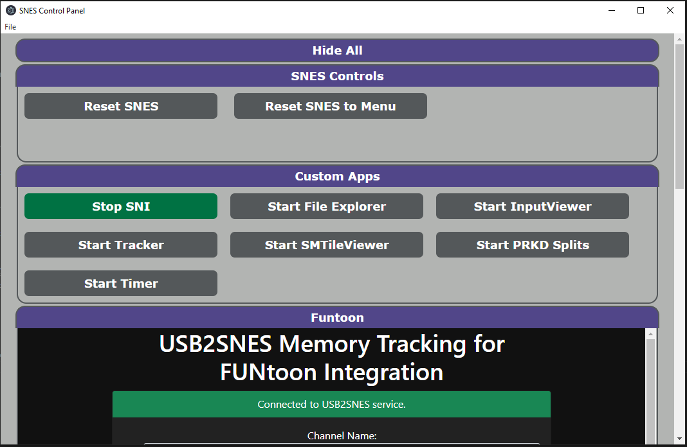

# SNES Control Panel

SNES Control Panel is a centralized user interface for managing various USB2SNES services, as well as a starting point for adding extra capabilities.



### Quick Start
In order to utilize the SNES Control Panel, you will need to modify the `config.json` file that lives next to the application.  `config.json` defines all of the apps, webpages and more that the panel will use.
- Add any applications that you'd like on your panel by adding a new entry for each app, e.g.:
    ```
        "apps": [
                {
                    "name": "SNI",
                    "args": [],
                    "cmd": "./sni.exe",
                    "working_directory": "./sni-v0.0.96-windows-amd64",
                    "env": {
                        "SNI_USB2SNES_LISTEN_ADDRS": "0.0.0.0:23074,0.0.0.0:8080"
                    },
                    "launch_on_start": true
                }
            ]

- Tips:
    - If no working_directory is supplied, the working directory will default to the location of the app
    - "name" is a required field
    - You can specify arguments in a list (use this to make various configs of the same application, e.g.multiple buttons to open different splits in livesplit)
    - Setting "launch_on_start" to `true` will cause the app to be launched on start of the panel

Applets work very similar to apps, but they are some embedded html to either be run in a popup window, or embedded in the panel itself.  This can be a local html (using js to interface w/ the snes) or some other html page.

See the json schema provided for all possible fields.

- The `usb2snes_address` key in the `usb2snes` group is only used by the controls natively supplied by the panel, such as reset and go to menu.
- All applications are created as child apps of the panel, so when you close the panel, all the running apps will be killed
