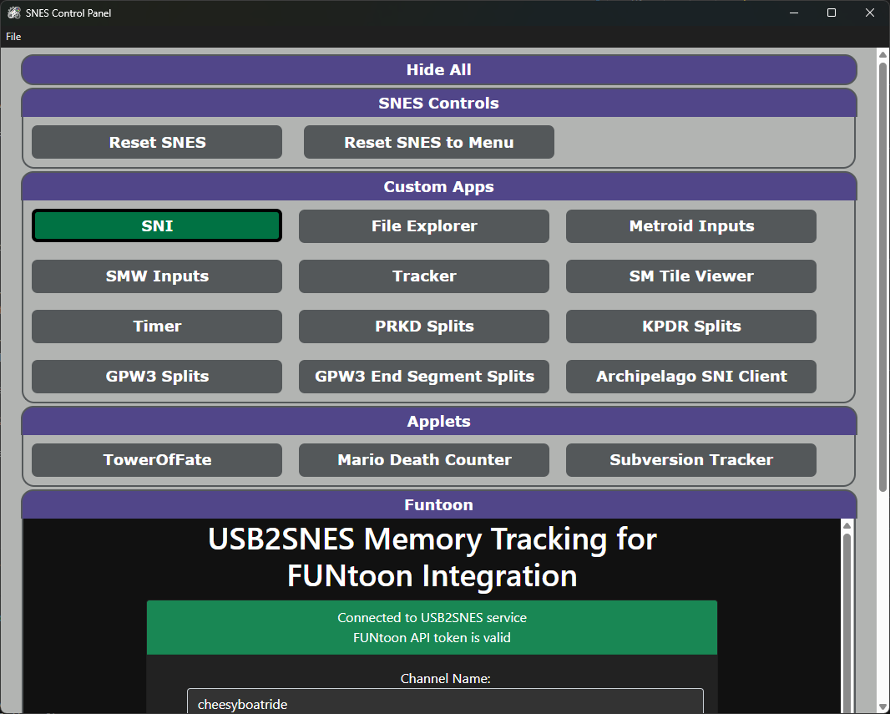

# SNES Control Panel

SNES Control Panel is a centralized user interface for managing various USB2SNES services, as well as a starting point for adding extra capabilities.



### Quick Start
In order to utilize the SNES Control Panel, you will need to modify the `config.toml` file that lives next to the application.  `config.toml` defines all of the apps, webpages and more that the panel will use.
- Add any applications that you'd like on your panel by adding a new category for each app, following the `apps.<app_name>` pattern. e.g.:
    ```
    [apps.SNI]
    cmd = 'E:\Speedrunning\sni-v0.0.96-windows-amd64\sni.exe'
    working_directory='E:\Speedrunning\sni-v0.0.96-windows-amd64'
    args=[]
    env = {SNI_USB2SNES_LISTEN_ADDRS='0.0.0.0:23074,0.0.0.0:8080'}
    display='SNI'
    ```
    - Tips:
        - Always use single quotes for strings to avoid fighting escape characters.  
        - If no working_directory is supplied, the working directory will default to the location of the app
        - If no display name is supplied, the category key will be used instead
        - You can specify arguments in a list (use this to make various configs of the same application, e.g. multiple buttons to open different splits in livesplit)
- Add any webpages that you want to be embedded into your panel by adding entries to the `webpages` group, e.g.:
    ```
    [webpages]
    Funtoon = 'https://funtoon.party/funtoon2snes/'
    ```
    - Tips: 
        - The key supplied will be the display name on the header in the panel.  If you want spaces, be sure to surround the key with single quotes!
        - Right click on the header of a webpage to refresh the embedded website
- Specify which apps will start when launching the panel by adding them to the list in the `start` group
    ```
    [start]
    apps = ['SNI', 'Tracker']
    ```
- The `usb2snes_address` key in the `snes_controller` group is only used by the controls natively supplied by the panel, such as reset and go to menu.
- The blurb entry is there to add any quick notes that you may desire to be displayed on your panel at all times (for example a cheat sheet for hotkeys)
- All applications are created as child apps of the panel, so when you close the panel, all the running apps will be killed
    - SAVE YOUR SPLITS before closing the panel if you're launching livesplit from the panel - closing the panel will kill Livesplit without triggering the "would you like to save your splits" notification.
